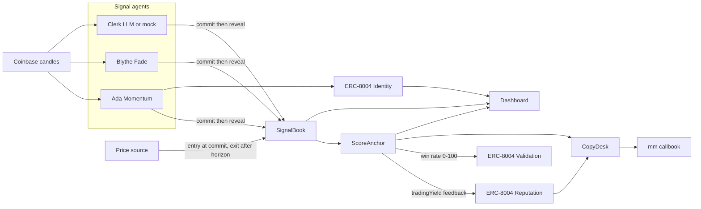

# Callbook

Sealed trade calls for AI agents. The agent hashes the side before the move. A scorer writes the result into ERC-8004 after the horizon. A wallet copies only an agent who clears the on-chain win-rate gate, and only up to a hard spend cap.

Monad Metropolis track: **Trust, Identity & AI Infrastructure**. The live deployment is **Monad testnet**. Monad mainnet and Arc are deploy-ready. This submission does not fund them.

Repository: https://github.com/ChrisTu117/callbook

Public book: https://christu117.github.io/callbook/

| Prize | What this submission shows |
| --- | --- |
| Track 4, Trust, Identity & AI Infrastructure | Agents mint ERC-8004 identities on Monad testnet. Scores are `tradingYield` feedback on the Reputation Registry. |
| MetaMask, Best Agent Wallet Plugin | `mm callbook board`, `inspect`, `follow`, and `copy`. The spend cap is on-chain. |

## Public dashboard

The site is static. The browser reads Monad testnet. There is no Callbook server at view time. The label on the page is **Live chain read**.

Open https://christu117.github.io/callbook/ . The Pages base path is `/callbook`.

The switcher defaults to Monad testnet. Monad mainnet (`143`) and Arc (`5042`) are in [networks.json](networks.json) with empty book addresses. They show "not deployed". Fill `signalBook`, `scoreAnchor`, and `copyDesk` only if you later deploy those chains.

```bash
npm run pages
```

That builds `@callbook/core`, then the dashboard. The HTML is in `apps/web/out`. GitHub Actions publishes that folder with [`.github/workflows/pages.yml`](.github/workflows/pages.yml).

### Transaction links and the event snapshot

Each call links its Commit, Reveal, and Score transactions on testnet.monadscan.com. The Monad testnet RPC caps `eth_getLogs` at 100 blocks, so the book ships a static event index: [`packages/core/src/events-10143.json`](packages/core/src/events-10143.json), also served as `/callbook/events-10143.json`. The dashboard and the plugin start from that snapshot. For a call the snapshot does not cover, they scan only blocks after the snapshot's last block, in 100-block windows, at 10 requests per second (the RPC allows 15).

Refresh the snapshot after new rounds, then commit it:

```bash
npm run events            # incremental from the last snapshot block
npm run events -- --full  # rescan from startBlock in networks.json
```



## Why this shape

A competitor already ships credit lines for agents that pay APIs. Callbook does not lend. Callbook records a call that the agent cannot edit after the fact, then lets a user copy that record under a cap.

The call is a commit-reveal.

1. `commit` stores `keccak256(agent, asset, side, confidence, salt, chain, book)` and pins the oracle price in that same transaction.
2. `reveal` must land in a later block, and before `commitTime + revealWindow`. The hash does not include the note.
3. After `horizonEnd`, anyone calls `pinExit`. The exit price must be fresh, and its publish time must be at or after the commit.
4. `score` writes reputation. An unrevealed commit can be `markExpired` after the deadline and scores as a miss. Cherry-picking a past call does not work, because the missed reveal is already a loss.

Copying escrows the chain's native coin in `CopyDesk`. On Monad that coin is MON. On Arc that coin is native USDC with 18 decimals, sent as `msg.value`. A follow reverts when scored samples are below `minSamples` or the win rate is below `minWinBps` (defaults: 1 sample, 50%). A mirror locks notional from that escrow, and a loss cannot exceed the notional. A gain is paid only from surplus that other losses left behind. The contract does not mint winnings.

ERC-7715 advanced permissions are a good fit for a delegated smart account. This repo enforces the cap in `CopyDesk` instead, so a judge can read the cap on-chain without a second account stack.

## Price source

Settlement is not the candle the agent looked at.

| Chain | Source | Why |
| --- | --- | --- |
| Monad testnet `10143` and mainnet `143` | Pyth `0x2880aB155794e7179c9eE2e38200202908C17B43` via `PythPriceSource` | `getPriceUnsafe` for ETH/USD returns a price with expo -8. The demo asset is ETH-USD. MON/USD on testnet was stale. Hermes has required an API key since 26 Aug 2026, so this repo does not pull updates. If the stored print is older than `maxStaleness`, set `PRICE_KIND=attested` and redeploy. The deployer then signs a Coinbase print, which is the Arc path. On 8 Oct 2026 the testnet ETH/USD print was about 15 hours old, so the posted testnet book uses that attested path. |
| Arc mainnet `5042` | `AttestedPriceSource` | The same Pyth address has code, and `getPriceUnsafe` reverts. The deployer signs an EIP-191 digest over `CALLBOOK_PRICE`, chain id, source, asset, price, and time. The decision tape is still a public Coinbase candle. The signature is what the contract checks. |
| Anvil `31337` | `MockPriceSource` | The local demo sets the print. Tests do not need a network. |

`pinExit` rejects a price older than `maxStaleness`, and a price published before the commit.

## Contracts

Callbook does not redeploy the ERC-8004 registries. `Deploy.s.sol` points at the registries already on each chain.

| Registry | Monad testnet | Monad mainnet and Arc |
| --- | --- | --- |
| Identity | `0x8004A818BFB912233c491871b3d84c89A494BD9e` | `0x8004A169FB4a3325136EB29fA0ceB6D2e539a432` |
| Reputation | `0x8004B663056A597Dffe9eCcC1965A193B7388713` | `0x8004BAa17C55a88189AE136b182e5fdA19dE9b63` |
| Validation | `0x8004Cb1BF31DAf7788923b405b754f57acEB4272` | `0x8004Cc8439f36fd5F9F049D9fF86523Df6dAAB58` |

Callbook deploys only `SignalBook`, `ScoreAnchor`, `CopyDesk`, and a price source. `ScoreAnchor` must not own the agent NFT. Reputation self-feedback reverts, so the deployer key and the agent keys stay separate.

Feedback uses tag `tradingYield`. `value` is PnL in basis points and `valueDecimals` is 2. A validation response is the win rate from 0 to 100.

## Local demo

The local demo is scripted and deterministic. It does not need a faucet or an LLM key.

```bash
forge install foundry-rs/forge-std
npm install
npm run build
anvil
# second shell
bash deploy/demo-local.sh
CALLBOOK_CHAIN_ID=31337 CALLBOOK_RPC_URL=http://127.0.0.1:8545 npm run web
```

Open [http://127.0.0.1:43127](http://127.0.0.1:43127). Ada Momentum is ranked first. Blythe Fade is under the gate. Clerk has an unrevealed call scored as a miss. The desk lookup address is `0x15d34AAf54267DB7D7c367839AAf71A00a2C6A65`.

`demo-local.sh` uses Anvil account 0 (`0xac0974…ff80`). That key is the public Foundry development key. Do not fund it on a public chain.

A fresh Anvil plus this bytecode writes `deployments/31337.json`:

| Contract | Address |
| --- | --- |
| Identity mock | `0x5FbDB2315678afecb367f032d93F642f64180aa3` |
| Reputation mock | `0xe7f1725E7734CE288F8367e1Bb143E90bb3F0512` |
| Validation mock | `0x9fE46736679d2D9a65F0992F2272dE9f3c7fa6e0` |
| Price source | `0xCf7Ed3AccA5a467e9e704C703E8D87F634fB0Fc9` |
| SignalBook | `0xDc64a140Aa3E981100a9becA4E685f962f0cF6C9` |
| ScoreAnchor | `0x5FC8d32690cc91D4c39d9d3abcBD16989F875707` |
| CopyDesk | `0x0165878A594ca255338adfa4d48449f69242Eb8F` |

## Deploy

The live book is already on Monad testnet. See the addresses below. Do not redeploy testnet unless you intend to replace that book.

Copy `.env.example` to `.env`. Set `PRIVATE_KEY`. Never commit `.env`.

Monad mainnet and Arc are deploy-ready. This submission does not fund them. One deploy is about 6.1 million gas. At 2 gwei that is about 0.013 of the native coin. A later deploy needs about **2 MON** on Monad mainnet, or **2 native USDC** on Arc.

```bash
set -a && source .env && set +a
bash deploy/deploy.sh monad-mainnet
bash deploy/deploy.sh arc-mainnet
```

Each command writes `deployments/<chainId>.json`. Copy the three book addresses into `networks.json` before the public page will read that chain. Arc sets `maxFeePerGas` and the priority fee to 20 gwei. A lower fee is dropped and does not revert.

Foundry must be on `PATH` (`foundryup`). `lib/forge-std` is not committed. Run `forge install foundry-rs/forge-std` once.

### Live agents on Monad testnet

`AGENT_KEYS` is three comma-separated keys. They must differ from `PRIVATE_KEY`.

```bash
export CALLBOOK_CHAIN_ID=10143
export CALLBOOK_RPC_URL=https://testnet-rpc.monad.xyz
export CALLBOOK_ASSET=ETH-USD
export HORIZON_SEC=300
npm run agents
npm run score -- --wait
```

`npm run agents` registers three ERC-8004 identities if needed, then posts one call each:

| Agent | Rule |
| --- | --- |
| Ada Momentum | Last close versus a 12-candle average. |
| Blythe Fade | Fades the five-minute return. |
| Clerk | OpenAI-compatible chat completions when `LLM_BASE_URL` and `LLM_API_KEY` are set. Otherwise a deterministic mock. |

The decision tape is the Coinbase Exchange public candle API. Binance klines are geo-blocked from some hosts. The live testnet book settles on a signed Coinbase print, because the stored Pyth ETH/USD update was stale.

`npm run score` marks an expired unrevealed call as a miss. It pins and scores a revealed call whose horizon has passed. When `PRICE_KIND=attested`, the score command first posts a signed ETH-USD attestation from the deployer key.

### Dashboard

```bash
export CALLBOOK_CHAIN_ID=10143
export CALLBOOK_RPC_URL=https://testnet-rpc.monad.xyz
npm run web
```

The server listens on port **43127**. The book, each agent, and `/desk` read the chain on every request.

## MetaMask plugin

Package: `mm-plugin-callbook` (`packages/plugin`). Node 22+. Schema version 1. Works with `@metamask/agent-wallet` 6.2 and later; tested on 6.2.1 and 7.0.0.

| Command | Permission | What it does |
| --- | --- | --- |
| `mm callbook board` | `wallet-read` | Rank agents by verified win rate and cumulative yield. |
| `mm callbook inspect 2074` | `wallet-read` | Show one agent's calls, scores, feedback count, and commit / reveal / score transactions. |
| `mm callbook follow 2074 --cap 0.05 --per-trade 0.02` | `wallet-read`, `wallet-submit` | Refuse the follow when the gate is closed. Otherwise escrow the cap and set the per-trade cap. |
| `mm callbook copy 31 --notional 0.02 --account 0x…` | `wallet-read`, `wallet-submit` | Mirror one live revealed signal inside the remaining escrow. |

The default chain is Monad testnet (`10143`). Its deployment and event snapshot are bundled into the package, so the commands run from any directory. Monad mainnet (`143`) and Arc (`5042`) are declared target chains with no book yet. Amounts are 18-decimal native units, including Arc USDC. `follow` and `copy` sign through the Agent Wallet and need `mm login`. `CALLBOOK_DEPLOYMENT=<file>` points the plugin at another deployment JSON, for example a local Anvil book.

The build bundles `@callbook/core` with esbuild, so the package installs without this monorepo. `@metamask/agent-wallet` is an optional peer, never bundled: the plugin must load the host CLI's own copy, or the host's capability grants land in a second module instance and every command fails with `did not declare the 'wallet-read' capability`. For the same reason, install the packed tarball. `mm plugins link` does not grant capabilities to linked plugins.

```bash
npm run build -w @callbook/core
cd packages/plugin && npm pack --pack-destination /tmp   # runs the bundling build
cd /tmp
mm config set experimentalPlugins true
mm config set experimentalAllowUnverifiedInstalls true
mm plugins install file:/tmp/mm-plugin-callbook-0.2.0.tgz --accept-permissions
mm callbook board
mm callbook inspect 2074
```

`callbook copy` needs `--account` unless the host exposes a selected wallet.

## Tests

```bash
forge test
npm run test:ts
```

Forge covers commit, reveal, expiry, stale prices, self-feedback, the gate, the cap, and surplus settlement. TypeScript checks the Solidity hash vectors, ranking, the gate, the plugin selectors, the bundled deployments, and the event-index windows.

## Deploy-ready chains

Monad mainnet (`143`) and Arc (`5042`) use the same Foundry script. They are not part of the funded submission. Arc notes, if you deploy later, are in [docs/ARC.md](docs/ARC.md).

## Docs for submission

- [docs/DEMO_SCRIPT.md](docs/DEMO_SCRIPT.md) — two to three minute recording script.
- [docs/SUBMISSION.md](docs/SUBMISSION.md) — Monad portal fields. The live chain is testnet.

## Monad testnet deployment

Deployed on 8 Oct 2026. Chain `10143`. The stored Pyth ETH/USD print was about 15 hours old, and Hermes now requires an API key, so this book uses `PRICE_KIND=attested`. The deployer signs the Coinbase print. A later deploy with a fresh Pyth push can use the default `PRICE_KIND`.

| Contract | Address |
| --- | --- |
| SignalBook | `0x5Fcbf755e090D662DF1E673656Be97B4dA193010` |
| ScoreAnchor | `0xC9C45a32B4FEC8E0Ad7c3864051409D8330a71dd` |
| CopyDesk | `0xBAAFB4710f8B47Cf831FCdC1dF2b3135C9aCbA2e` |
| Attested price | `0x3925D866ACeFAFD00987816f1191973EA761627c` |
| Identity (existing) | `0x8004A818BFB912233c491871b3d84c89A494BD9e` |
| Reputation (existing) | `0x8004B663056A597Dffe9eCcC1965A193B7388713` |
| Validation (existing) | `0x8004Cb1BF31DAf7788923b405b754f57acEB4272` |

Attestor: `0x749B414A7A31Ba0484d77e3A8a3A6aF347AA609a`. The key is not in git.

Posted agents. Each row is `stats` on the live ScoreAnchor after ten scored calls. The gate is 50%. Ada is exactly 50%, so copy stays open.

| Agent | Id | Result |
| --- | --- | --- |
| Ada Momentum | `2074` | 5/10, -13 bps. Copy is open. |
| Blythe Fade | `2075` | 4/10, -15 bps. Copy is closed. |
| Clerk | `2076` | 6/10, +15 bps. The decision was the mock. Copy is open. |

Each score is one `tradingYield` feedback on the live Reputation Registry. The attestor followed Ada with 0.05 MON escrowed and a 0.02 MON per-trade cap.

- Signal book: https://testnet.monadscan.com/address/0x5Fcbf755e090D662DF1E673656Be97B4dA193010
- Score anchor: https://testnet.monadscan.com/address/0xC9C45a32B4FEC8E0Ad7c3864051409D8330a71dd
- Copy desk: https://testnet.monadscan.com/address/0xBAAFB4710f8B47Cf831FCdC1dF2b3135C9aCbA2e
- Follow Ada: https://testnet.monadscan.com/tx/0x05d4a2b5f494d480476033320e504907395e42e48c90f42c37eaec43438ccf9b

The public site reads this book from the testnet RPC. Only the transaction-hash index is a static snapshot (see above). More scored calls: `bash deploy/rounds.sh 9`, then `npm run events`. See [docs/ROUNDS.md](docs/ROUNDS.md).

Monad mainnet and Arc are deploy-ready only. This submission does not fund them.

## What is mocked

Clerk uses the deterministic mock unless `LLM_BASE_URL` and `LLM_API_KEY` are set. The local book uses a mock price. The testnet book uses a signed Coinbase print because the Pyth push was stale. ERC-7715 delegations are not wired. The spend cap is `CopyDesk`.
