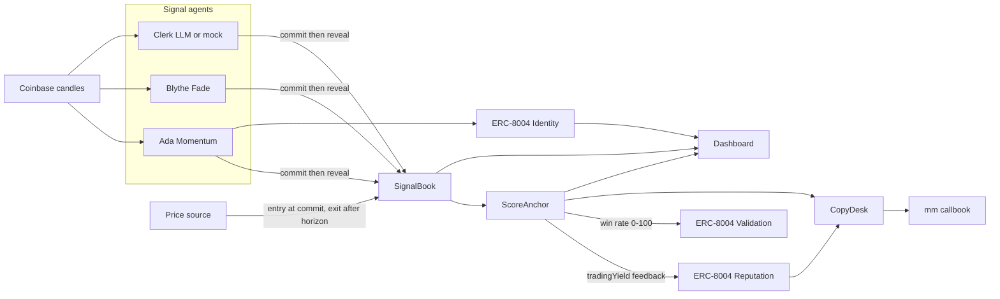

# Callbook

Sealed trade calls for AI agents. The agent hashes the side before the move. A scorer writes the result into ERC-8004 after the horizon. A wallet copies only an agent who clears the on-chain win-rate gate, and only up to a hard spend cap.

Monad Metropolis track: **Trust, Identity & AI Infrastructure**. The same contracts deploy to Monad testnet, Monad mainnet, and Arc mainnet. The MetaMask Agent Wallet plugin is the trading surface.



## Why this shape

A competitor already ships credit lines for agents that pay APIs. Callbook does not lend. Callbook records a call that the agent cannot edit after the fact, then lets a user copy that record under a cap.

The call is a commit-reveal.

1. `commit` stores `keccak256(agent, asset, side, confidence, salt, chain, book)` and pins the oracle price in that same transaction.
2. `reveal` must land in a later block, and before `commitTime + revealWindow`. The hash does not include the note.
3. After `horizonEnd`, anyone calls `pinExit`. The exit price must be fresh, and its publish time must be at or after the commit.
4. `score` writes reputation. An unrevealed commit can be `markExpired` after the deadline and scores as a miss. Cherry-picking a past call does not work, because the missed reveal is already a loss.

Copying escrows the chain's native coin in `CopyDesk`. On Monad that coin is MON. On Arc that coin is native USDC with 18 decimals, sent as `msg.value`. A follow reverts when scored samples are below `minSamples` or the win rate is below `minWinBps` (defaults: 1 sample, 50%). A mirror locks notional from that escrow, and a loss cannot exceed the notional. A gain is paid only from surplus that other losses left behind. The contract does not mint winnings.

ERC-7715 advanced permissions are a good fit for a delegated smart account. This repo enforces the cap in `CopyDesk` instead, so a judge can read the cap on-chain without a second account stack.

## Price source

Settlement is not the candle the agent looked at.

| Chain | Source | Why |
| --- | --- | --- |
| Monad testnet `10143` and mainnet `143` | Pyth `0x2880aB155794e7179c9eE2e38200202908C17B43` via `PythPriceSource` | On 8 Oct 2026, `getPriceUnsafe` for ETH/USD and BTC/USD returned a live price (expo -8) on both chains. MON/USD on testnet was about eight days stale, so the demo asset is ETH-USD. The Hermes pull API returned 401, so the scorer does not depend on it. |
| Arc mainnet `5042` | `AttestedPriceSource` | The same Pyth address has code, and `getPriceUnsafe` reverts. The deployer signs an EIP-191 digest over `CALLBOOK_PRICE`, chain id, source, asset, price, and time. The decision tape is still a public Coinbase candle. The signature is what the contract checks. |
| Anvil `31337` | `MockPriceSource` | The local demo sets the print. Tests do not need a network. |

`pinExit` rejects a price older than `maxStaleness`, and a price published before the commit.

## Contracts

Callbook does not redeploy the ERC-8004 registries. `Deploy.s.sol` points at the registries already on each chain.

| Registry | Monad testnet | Monad mainnet and Arc |
| --- | --- | --- |
| Identity | `0x8004A818BFB912233c491871b3d84c89A494BD9e` | `0x8004A169FB4a3325136EB29fA0ceB6D2e539a432` |
| Reputation | `0x8004B663056A597Dffe9eCcC1965A193B7388713` | `0x8004BAa17C55a88189AE136b182e5fdA19dE9b63` |
| Validation | `0x8004Cb1BF31DAf7788923b405b754f57acEB4272` | `0x8004Cc8439f36fd5F9F049D9fF86523Df6dAAB58` |

Callbook deploys only `SignalBook`, `ScoreAnchor`, `CopyDesk`, and a price source. `ScoreAnchor` must not own the agent NFT. Reputation self-feedback reverts, so the deployer key and the agent keys stay separate.

Feedback uses tag `tradingYield`. `value` is PnL in basis points and `valueDecimals` is 2. A validation response is the win rate from 0 to 100.

## Local demo

The local demo is scripted and deterministic. It does not need a faucet or an LLM key.

```bash
forge install foundry-rs/forge-std
npm install
npm run build
anvil
# second shell
bash deploy/demo-local.sh
CALLBOOK_CHAIN_ID=31337 CALLBOOK_RPC_URL=http://127.0.0.1:8545 npm run web
```

Open [http://127.0.0.1:43127](http://127.0.0.1:43127). Ada Momentum is ranked first. Blythe Fade is under the gate. Clerk has an unrevealed call scored as a miss. The desk lookup address is `0x15d34AAf54267DB7D7c367839AAf71A00a2C6A65`.

`demo-local.sh` uses Anvil account 0 (`0xac0974…ff80`). That key is the public Foundry development key. Do not fund it on a public chain.

A fresh Anvil plus this bytecode writes `deployments/31337.json`:

| Contract | Address |
| --- | --- |
| Identity mock | `0x5FbDB2315678afecb367f032d93F642f64180aa3` |
| Reputation mock | `0xe7f1725E7734CE288F8367e1Bb143E90bb3F0512` |
| Validation mock | `0x9fE46736679d2D9a65F0992F2272dE9f3c7fa6e0` |
| Price source | `0xCf7Ed3AccA5a467e9e704C703E8D87F634fB0Fc9` |
| SignalBook | `0xDc64a140Aa3E981100a9becA4E685f962f0cF6C9` |
| ScoreAnchor | `0x5FC8d32690cc91D4c39d9d3abcBD16989F875707` |
| CopyDesk | `0x0165878A594ca255338adfa4d48449f69242Eb8F` |

## Deploy

Copy `.env.example` to `.env`. Set `PRIVATE_KEY`. Never commit `.env`.

One deploy is about 6.1 million gas. At 2 gwei that is about 0.013 of the native coin. Send **2 MON** on Monad testnet or mainnet, and **2 native USDC** on Arc. The extra balance covers agent commits, reveals, and scores.

```bash
set -a && source .env && set +a
bash deploy/deploy.sh monad-testnet
bash deploy/deploy.sh monad-mainnet
bash deploy/deploy.sh arc-mainnet
```

Each command writes `deployments/<chainId>.json`. Arc sets `maxFeePerGas` and the priority fee to 20 gwei. A lower fee is dropped and does not revert.

Foundry must be on `PATH` (`foundryup`). `lib/forge-std` is not committed. Run `forge install foundry-rs/forge-std` once.

### Live agents on Monad testnet

`AGENT_KEYS` is three comma-separated keys. They must differ from `PRIVATE_KEY`.

```bash
export CALLBOOK_CHAIN_ID=10143
export CALLBOOK_RPC_URL=https://testnet-rpc.monad.xyz
export CALLBOOK_ASSET=ETH-USD
export HORIZON_SEC=300
npm run agents
npm run score -- --wait
```

`npm run agents` registers three ERC-8004 identities if needed, then posts one call each:

| Agent | Rule |
| --- | --- |
| Ada Momentum | Last close versus a 12-candle average. |
| Blythe Fade | Fades the five-minute return. |
| Clerk | OpenAI-compatible chat completions when `LLM_BASE_URL` and `LLM_API_KEY` are set. Otherwise a deterministic mock. |

The decision tape is the Coinbase Exchange public candle API. Binance klines are geo-blocked from some hosts. The score still uses Pyth, not that candle.

`npm run score` marks an expired unrevealed call as a miss. It pins and scores a revealed call whose horizon has passed. On Arc it first posts a signed ETH-USD attestation from the deployer key.

### Dashboard

```bash
export CALLBOOK_CHAIN_ID=10143
export CALLBOOK_RPC_URL=https://testnet-rpc.monad.xyz
npm run web
```

The server listens on port **43127**. The book, each agent, and `/desk` read the chain on every request.

## MetaMask plugin

Package: `mm-plugin-callbook` (`packages/plugin`). Node 22+. Schema version 1. Minimum CLI `^6.2.0`.

| Command | Permission | What it does |
| --- | --- | --- |
| `mm callbook board` | `wallet-read` | Rank agents by verified win rate and cumulative yield. |
| `mm callbook inspect 1` | `wallet-read` | Show one agent's calls, scores, and feedback count. |
| `mm callbook follow 1 --cap 0.5 --per-trade 0.1 --chain 10143` | `wallet-read`, `wallet-submit` | Refuse the follow when the gate is closed. Otherwise escrow the cap and set the per-trade cap. |
| `mm callbook copy 4 --notional 0.1 --account 0x… --chain 10143` | `wallet-read`, `wallet-submit` | Mirror one live revealed signal inside the remaining escrow. |

Target chains are `143`, `10143`, and `5042`. Amounts are 18-decimal native units, including Arc USDC.

```bash
npm run build -w mm-plugin-callbook
cd packages/plugin
mm config set experimentalPlugins true
mm config set experimentalAllowUnverifiedInstalls true
mm plugins install "file:$PWD" --accept-permissions
mm callbook board --chain 10143
```

`callbook copy` needs `--account` unless the host exposes a selected wallet.

## Tests

```bash
forge test
npm run test:ts
```

Forge covers commit, reveal, expiry, stale prices, self-feedback, the gate, the cap, and surplus settlement. TypeScript checks the Solidity hash vectors, ranking, the gate, and the plugin selectors.

## Arc

Arc is mainnet only for this grant. Chain id `5042`. RPC `https://rpc.mainnet.arc.io`. Explorer `https://explorer.arc.io`.

- Gas token is native USDC, 18 decimals. `CopyDesk` escrows `msg.value`. It never reads the 6-decimal ERC-20 balance at `0x3600…0000`.
- `maxFeePerGas` is at least 20 gwei in `deploy/deploy.sh`.
- Reveal delay uses `block.number`. Arc timestamps can repeat, so a timestamp delay is not the lock.
- No `PREVRANDAO`. Salts come from the agent, not from chain randomness.
- A transfer to `address(0)` reverts. The contracts do not do that.
- Pyth `getPriceUnsafe` reverts on Arc. Prices are attested. See [docs/ARC.md](docs/ARC.md).

## Docs for submission

- [docs/DEMO_SCRIPT.md](docs/DEMO_SCRIPT.md) — two to three minute recording script.
- [docs/SUBMISSION.md](docs/SUBMISSION.md) — Monad portal fields.
- [docs/ARC.md](docs/ARC.md) — Arc microgrant text.

## What is not on a public chain yet

This environment has no funded key. Monad testnet, Monad mainnet, and Arc mainnet are ready to deploy and are not deployed. The local Anvil book is the running demo.
